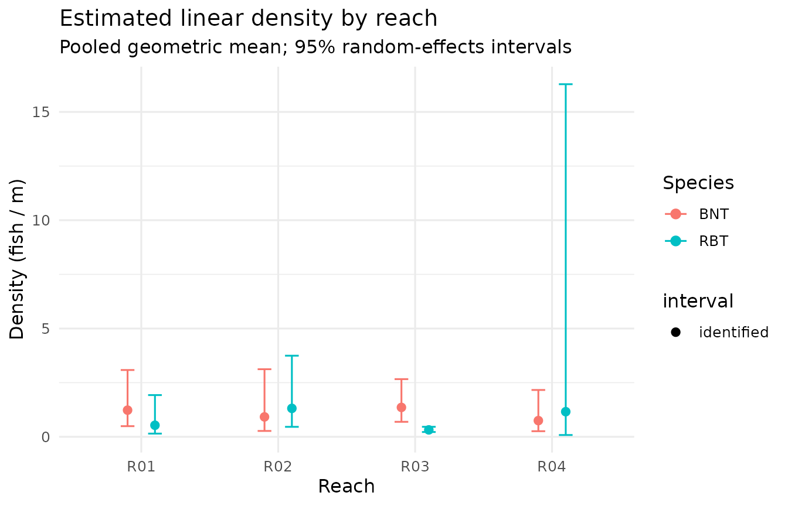

# Analyzing electrofishing CPUE with electrocpue

## Overview

`electrocpue` turns raw multi-pass electrofishing records into
abundance, density, and catch-per-unit-effort (CPUE) estimates. The
workflow has four steps:

1.  **Validate** the catch and reach-metadata tables.
2.  **Estimate** removal-depletion abundance for each removal series.
3.  **Analyze** — wire validation, estimation, effort standardization,
    and density together in one call.
4.  **Summarize** repeat surveys up to a reach level with confidence
    intervals.

``` r

library(electrocpue)
```

## The example data

The package ships a small simulated dataset: four reaches, each surveyed
on two dates, with two species and three removal passes per survey.

``` r

head(example_catch)
#>   reach_id       date pass_number species count effort_seconds amperage voltage
#> 1      R01 2025-06-15           1     BNT    82            481      3.8     227
#> 2      R01 2025-06-15           2     BNT    42            486      3.8     292
#> 3      R01 2025-06-15           3     BNT    19            489      4.1     251
#> 4      R01 2025-06-15           1     RBT    38            481      3.8     227
#> 5      R01 2025-06-15           2     RBT    15            486      3.8     292
#> 6      R01 2025-06-15           3     RBT     3            489      4.1     251

example_reach
#>   reach_id length_m mean_width_m habitat_class               crew
#> 1      R01      120          6.5        riffle BW-Gold Field Team
#> 2      R02       95          5.0           run BW-Gold Field Team
#> 3      R03      150          8.2          pool BW-Gold Field Team
#> 4      R04       80          4.1        riffle BW-Gold Field Team
#>               gear area_m2
#> 1 Smith-Root LR-24     780
#> 2 Smith-Root LR-24     475
#> 3 Smith-Root LR-24    1230
#> 4 Smith-Root LR-24     328
```

`example_catch` is **long format**: one row per reach × date × pass ×
species. `example_reach` carries the reach length (and, here, area) used
to convert abundance into density.

## Step 1 — Validate

[`validate_cpue_input()`](https://shepherd70.github.io/electrocpue/reference/validate_cpue_input.md)
runs a battery of structural and content checks and reports every
problem at once. It returns invisibly on success.

``` r

validate_cpue_input(example_catch, example_reach, strict = FALSE)
```

## Step 2 — Estimate a single series

The removal estimators work on a vector of per-pass catches. `"auto"`
uses the Zippin maximum-likelihood estimator and falls back to Carle &
Strub when the Zippin model fails.

``` r

# Brown trout at R01, first visit: 82, 42, 19
estimate_population(c(82, 42, 19), method = "auto")
#>   method n_passes catch_total   N     N_se N_lwr N_upr         p       p_se
#> 1 zippin        3         143 161 8.473939   149   184 0.5162455 0.05616823
#>   converged identifiable note
#> 1      TRUE         TRUE   ok
```

The result reports the abundance estimate `N`, its standard error
`N_se`, the per-pass capture probability `p`, and a `converged` flag.

## Step 3 — Analyze the whole dataset

[`analyze_cpue()`](https://shepherd70.github.io/electrocpue/reference/analyze_cpue.md)
does everything at once and returns one tidy row per reach × date ×
species. Here we standardize effort by amp-seconds, which requires the
`amperage` column present in `example_catch`.

``` r

res <- analyze_cpue(
  example_catch, example_reach,
  method       = "auto",
  effort_basis = "amp_seconds"
)

res[, c("reach_id", "date", "species", "N", "N_se",
        "density_per_m", "density_per_m2", "cpue")]
#> # A tibble: 16 × 8
#>    reach_id date       species     N  N_se density_per_m density_per_m2    cpue
#>    <chr>    <date>     <chr>   <dbl> <dbl>         <dbl>          <dbl>   <dbl>
#>  1 R01      2025-06-15 BNT       161  8.47         1.34          0.206  0.0252 
#>  2 R01      2025-06-15 RBT        58  1.97         0.483         0.0744 0.00986
#>  3 R01      2025-08-20 BNT       139  2.91         1.16          0.178  0.0254 
#>  4 R01      2025-08-20 RBT        71  2.68         0.592         0.0910 0.0128 
#>  5 R02      2025-06-15 BNT        95  8.61         1             0.2    0.0181 
#>  6 R02      2025-06-15 RBT       119  9.29         1.25          0.251  0.0229 
#>  7 R02      2025-08-20 BNT        81  6.74         0.853         0.171  0.0179 
#>  8 R02      2025-08-20 RBT       132 11.0          1.39          0.278  0.0280 
#>  9 R03      2025-06-15 BNT       210 10.6          1.4           0.171  0.0295 
#> 10 R03      2025-06-15 RBT        47  1.32         0.313         0.0382 0.00738
#> 11 R03      2025-08-20 BNT       190 13.0          1.27          0.154  0.0253 
#> 12 R03      2025-08-20 RBT        50  2.04         0.333         0.0407 0.00758
#> 13 R04      2025-06-15 BNT        65  1.95         0.812         0.198  0.0179 
#> 14 R04      2025-06-15 RBT       117 13.0          1.46          0.357  0.0267 
#> 15 R04      2025-08-20 BNT        55  1.41         0.688         0.168  0.0172 
#> 16 R04      2025-08-20 RBT        77  5.64         0.962         0.235  0.0220
```

Both length-based (`density_per_m`) and areal (`density_per_m2`) density
are returned; areal density is `NA` when reach area is unavailable.

## Step 4 — Summarize repeat surveys

[`summarize_cpue()`](https://shepherd70.github.io/electrocpue/reference/summarize_cpue.md)
collapses the repeat visits per reach to a single reach × species
summary with a confidence interval on density. The reported density is a
random-effects pooled geometric mean, and its interval combines each
survey’s method-aligned likelihood uncertainty with between-survey
variation on the log scale. A reach is flagged `weak` (and
`n_identified` records how many surveys backed the interval) when too
few surveys are well enough identified to support it — at low capture
probability the removal estimate is biased, so the interval is withheld
rather than shown as a confident bar.

``` r

smry <- summarize_cpue(res, level = 0.95)
smry[, c("reach_id", "species", "n_surveys", "n_identified", "weak",
         "N_mean", "density_per_m_mean",
         "density_per_m_lwr", "density_per_m_upr")]
#> # A tibble: 8 × 9
#>   reach_id species n_surveys n_identified weak  N_mean density_per_m_mean
#>   <chr>    <chr>       <int>        <int> <lgl>  <dbl>              <dbl>
#> 1 R01      BNT             2            2 FALSE  150                1.23 
#> 2 R01      RBT             2            2 FALSE   64.5              0.533
#> 3 R02      BNT             2            2 FALSE   88                0.919
#> 4 R02      RBT             2            2 FALSE  126.               1.31 
#> 5 R03      BNT             2            2 FALSE  200                1.36 
#> 6 R03      RBT             2            2 FALSE   48.5              0.320
#> 7 R04      BNT             2            2 FALSE   60                0.748
#> 8 R04      RBT             2            2 FALSE   97                1.16 
#> # ℹ 2 more variables: density_per_m_lwr <dbl>, density_per_m_upr <dbl>
```

## Visualizing density with uncertainty

Identified reaches carry a 95% interval; a `weak` reach is drawn as a
hollow point with no bar (the interval would not be trustworthy).

``` r

library(ggplot2)

ggplot(smry, aes(x = reach_id, y = density_per_m_mean, colour = species)) +
  geom_errorbar(
    aes(ymin = density_per_m_lwr, ymax = density_per_m_upr),
    width = 0.2,
    position = position_dodge(width = 0.4)
  ) +
  geom_point(aes(shape = weak),
             position = position_dodge(width = 0.4), size = 2.5) +
  scale_shape_manual(
    values = c(`FALSE` = 16, `TRUE` = 1),
    labels = c(`FALSE` = "identified", `TRUE` = "weak"),
    name   = "interval"
  ) +
  labs(
    x = "Reach", y = "Density (fish / m)", colour = "Species",
    title = "Estimated linear density by reach",
    subtitle = "Pooled geometric mean; 95% random-effects intervals"
  ) +
  theme_minimal(base_size = 12)
```



## Choosing an estimator

- **`"zippin"`** — classic maximum-likelihood depletion estimator;
  reports `NA` when the catch series shows insufficient depletion.
- **`"carle_strub"`** — weighted-likelihood (Bayesian) estimator; more
  robust when depletion is weak, and the recommended default for routine
  use.
- **`"auto"`** — Zippin first, Carle & Strub as a fallback.

Point estimates and standard errors match
[`FSA::removal()`](https://fishr-core-team.github.io/FSA/reference/removal.html),
so results are directly comparable to that reference implementation.
